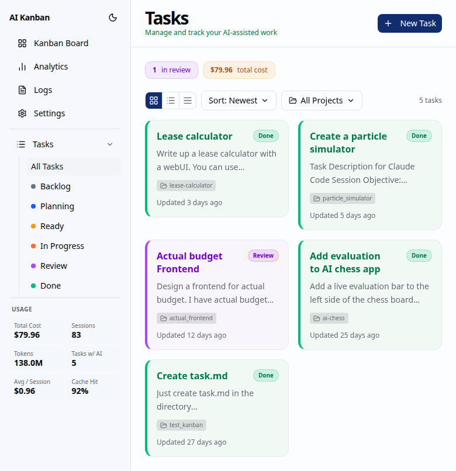
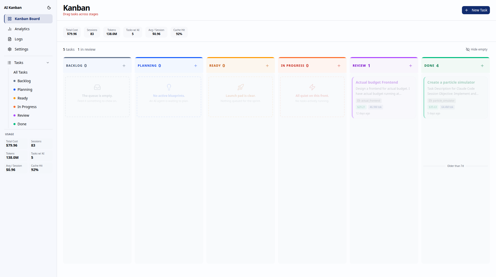
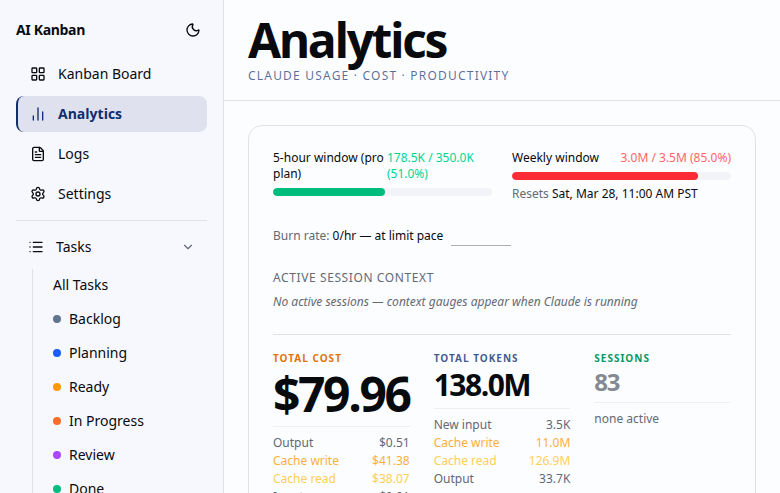

# AI Kanban

A local-first AI task automation platform that orchestrates Claude CLI agents on a Kanban board. Run multiple AI agents in parallel, track token usage, and manage tasks through a clean dashboard.







## Prerequisites

- [Claude CLI](https://docs.anthropic.com/en/docs/claude-cli) installed and authenticated (`claude` must be on your PATH)

## Quick Start — Download Binary

### Linux
```bash
curl -L https://github.com/Srivastava/ai-kanban/releases/latest/download/ai-kanban-linux-x86_64 -o ai-kanban
chmod +x ai-kanban
./ai-kanban
```

### macOS (Apple Silicon)
```bash
curl -L https://github.com/Srivastava/ai-kanban/releases/latest/download/ai-kanban-macos-arm64 -o ai-kanban
chmod +x ai-kanban
./ai-kanban
```

### macOS (Intel)
```bash
curl -L https://github.com/Srivastava/ai-kanban/releases/latest/download/ai-kanban-macos-x86_64 -o ai-kanban
chmod +x ai-kanban
./ai-kanban
```

### Windows
Download `ai-kanban-windows-x86_64.exe` from the [latest release](https://github.com/Srivastava/ai-kanban/releases/latest) and run it.

Open `http://localhost:3001` in your browser.

## Build from Source

Requires: Rust stable toolchain, Node.js 20+, Claude CLI

```bash
git clone https://github.com/Srivastava/ai-kanban
cd ai-kanban
./install.sh
./ai-kanban
```

## Data

The app stores its database at `data/ai-kanban.db` in the directory where you run the binary. This directory is created automatically on first run.

## License

[Business Source License 1.1](LICENSE) — free for personal and non-production use. Commercial/production use by organizations requires a commercial license. Converts to Apache 2.0 on 2030-03-27.
