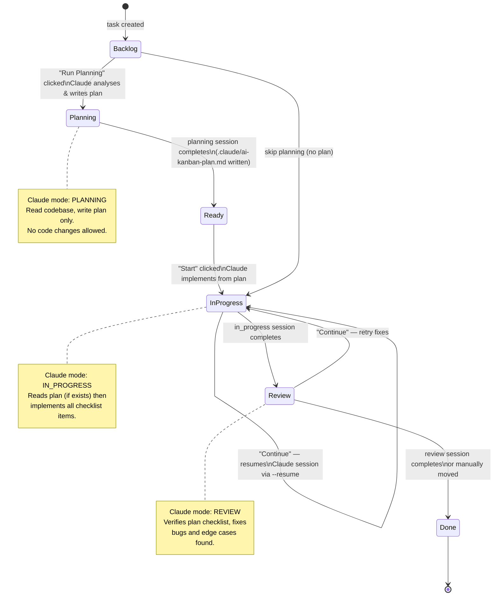
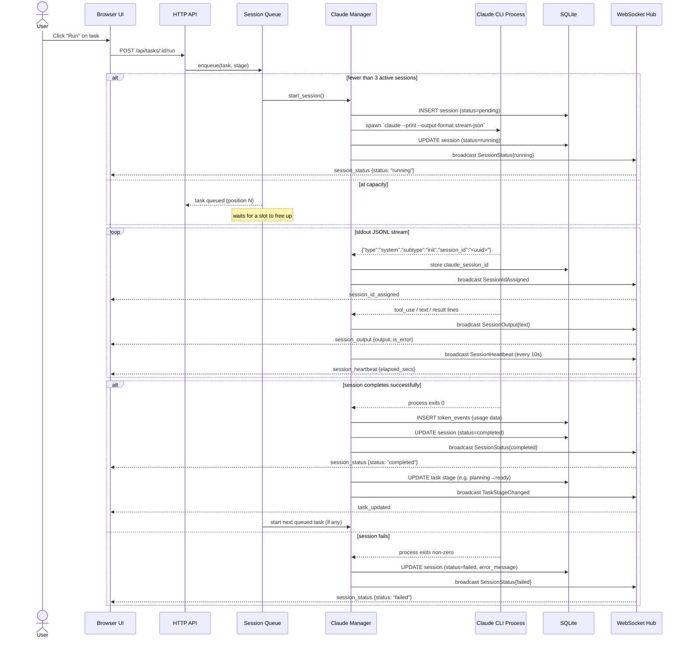
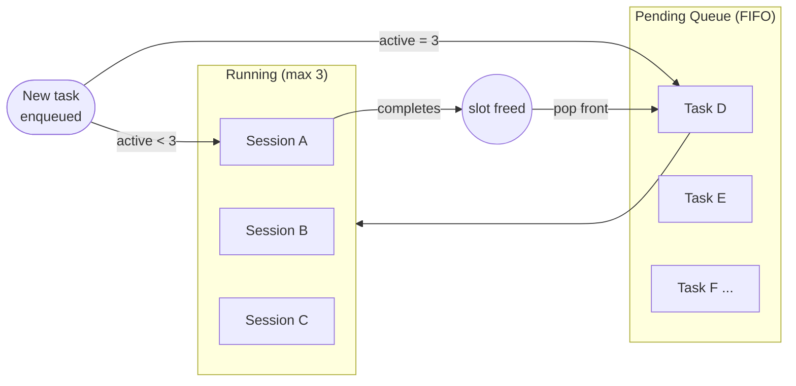
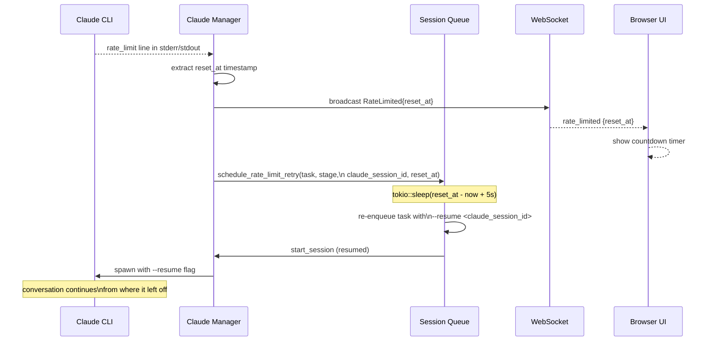
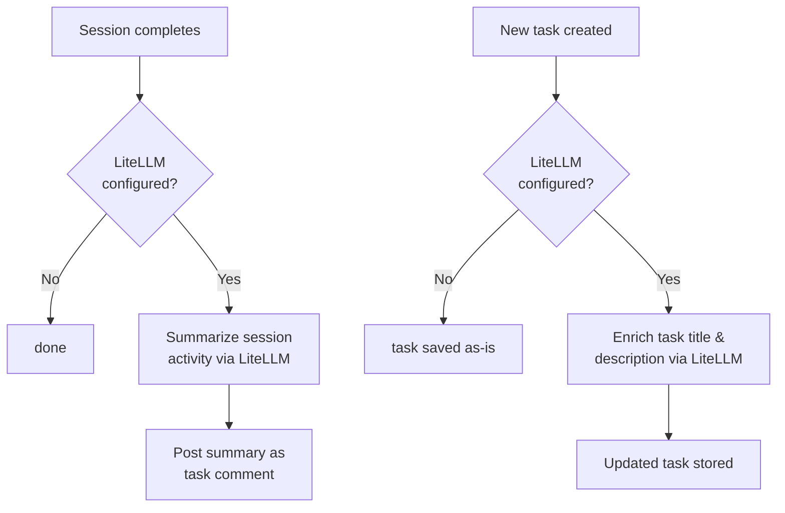

# AI Kanban

A local-first AI task automation platform that orchestrates Claude CLI agents on a Kanban board. Run multiple AI agents in parallel, track token usage and costs in real time, and manage tasks through a clean dashboard.


---

## Table of Contents

- [Prerequisites](#prerequisites)
- [Quick Start — npm](#quick-start--npm)
- [Quick Start — Download Binary](#quick-start--download-binary)
- [Build from Source](#build-from-source)
- [Data Storage](#data-storage)
- [How It Works](#how-it-works)
  - [System Architecture](#system-architecture)
  - [Task Lifecycle](#task-lifecycle)
  - [Session Execution Flow](#session-execution-flow)
  - [Queue and Concurrency](#queue-and-concurrency)
  - [Rate Limit Handling](#rate-limit-handling)
  - [WebSocket Events](#websocket-events)
  - [Context Management (LiteLLM)](#context-management-litellm)
- [Features](#features)
- [API Reference](#api-reference)
- [Observability](#observability)
- [Configuration](#configuration)
- [License](#license)

---

## Prerequisites

- [Claude CLI](https://docs.anthropic.com/en/docs/claude-cli) installed and authenticated (`claude` must be on your PATH)

---

## Quick Start — npm

The easiest way to install on any platform:

```bash
npm install -g ai-kanban
ai-kanban
```

Open `http://localhost:3001` in your browser.

---

## Quick Start — Download Binary

### Linux
```bash
curl -L https://github.com/Srivastava/ai-kanban/releases/latest/download/ai-kanban-linux-x86_64 -o ai-kanban
chmod +x ai-kanban
./ai-kanban
```

### macOS (Apple Silicon)
```bash
curl -L https://github.com/Srivastava/ai-kanban/releases/latest/download/ai-kanban-macos-arm64 -o ai-kanban
chmod +x ai-kanban
./ai-kanban
```

### macOS (Intel)
```bash
curl -L https://github.com/Srivastava/ai-kanban/releases/latest/download/ai-kanban-macos-x86_64 -o ai-kanban
chmod +x ai-kanban
./ai-kanban
```

### Windows
Download `ai-kanban-windows-x86_64.exe` from the [latest release](https://github.com/Srivastava/ai-kanban/releases/latest) and run it.

Open `http://localhost:3001` in your browser.

---

## Build from Source

Requires: Rust stable toolchain, Node.js 20+, Claude CLI

```bash
git clone https://github.com/Srivastava/ai-kanban
cd ai-kanban
./install.sh
./ai-kanban
```

The install script builds the Next.js frontend, embeds it into the Rust binary as static files, then compiles the binary. The final artifact is a single self-contained executable.

---

## Data Storage

The app creates a `data/` directory in whatever directory you run the binary from:

```
./data/
  ai-kanban.db      ← SQLite database (tasks, sessions, logs, analytics)
```

Attachments are stored in `~/.ai-kanban/attachments/` by default (override with `ATTACHMENTS_DIR`).

---

## How It Works

### System Architecture

```mermaid
graph TB
    subgraph Browser["Browser (Next.js SPA)"]
        UI[Kanban / Tasks / Analytics / Logs]
        WS_Client[WebSocket Client]
    end

    subgraph Binary["ai-kanban binary (Rust / Axum)"]
        HTTP[HTTP API :3001]
        WS_Server[WebSocket /ws]
        Queue[Session Queue\nmax 3 concurrent]
        Manager[Claude Manager]
        DB[(SQLite WAL\nai-kanban.db)]
        DbLayer[Tracing DB Layer\nasync batch writer]
        Metrics[Prometheus /metrics]
        Health[/health endpoint]
        Watchdog[Zombie Session\nWatchdog ×5 min]
    end

    subgraph Claude["Claude CLI process (spawned per session)"]
        ClaudeProc[claude --print\n--output-format stream-json]
    end

    subgraph Optional["Optional — LiteLLM (self-hosted)"]
        LiteLLM[LiteLLM proxy\nport 4000/14000]
    end

    UI -->|REST| HTTP
    UI -->|live events| WS_Client
    WS_Client <-->|ws://| WS_Server
    HTTP --> Queue
    Queue --> Manager
    Manager -->|spawn| ClaudeProc
    ClaudeProc -->|stdout JSONL| Manager
    Manager -->|broadcast channel| WS_Server
    Manager --> DB
    DbLayer -->|async batches| DB
    Watchdog --> Manager
    Health --> DB
    Metrics --> DB
    Manager -->|session summary| LiteLLM
    LiteLLM -->|enrichment / summarize| DB
```

The single binary serves the embedded Next.js frontend as static files, exposes the REST + WebSocket API, and manages all Claude processes. No external services are required — LiteLLM is optional and only needed for AI-powered session summaries.

---

### Task Lifecycle

Every task moves through six stages on the Kanban board. AI sessions can be launched at three of them.



---

### Session Execution Flow

When a task is dispatched to Claude, here is the full lifecycle from API call to WebSocket event reaching the browser:



---

### Queue and Concurrency

Up to **3 Claude sessions** run concurrently. Requests beyond that are held in an in-memory FIFO queue and started automatically as slots free up.



The queue also handles **task cancellation** — calling `DELETE /api/sessions/:id/stop` removes the task from the queue if it has not started yet, or sends SIGKILL to the Claude process if it is running.

---

### Rate Limit Handling

When Claude hits an API usage limit, AI Kanban automatically detects the `reset_at` timestamp from the output stream, waits for the window to reset, and re-queues the task using `--resume` so the conversation continues seamlessly.



---

### WebSocket Events

The browser connects to `ws://localhost:3001/ws` and receives a stream of server-push events. No polling required.

| Event type | Payload | When sent |
|---|---|---|
| `session_status` | `{ session_id, status }` | Session starts, completes, fails, or is stopped |
| `session_output` | `{ session_id, output, is_error }` | Each line of Claude's output stream |
| `session_heartbeat` | `{ session_id, elapsed_secs }` | Every ~10 seconds while session is running |
| `session_id_assigned` | `{ session_id, claude_session_id }` | After Claude emits its init message |
| `task_updated` | `{ task }` | Task stage or metadata changes |
| `rate_limited` | `{ session_id, task_id, reset_at }` | Claude hits a usage limit |
| `stage_context_set` | `{ session_id, task_id, mode }` | Session start — which Claude mode is active |
| `context_file_updated` | `{ session_id, task_id }` | `.claude/ai-kanban.md` written to project |
| `plan_created` | `{ session_id, task_id, preview }` | Plan file saved during planning stage |
| `enrichment_started` | `{ task_id }` | LiteLLM enrichment begins |
| `enrichment_completed` | `{ task_id }` | LiteLLM enrichment completes |

Clients can also **subscribe** to a specific task or session to receive filtered events:

```json
{ "type": "subscribe_task",    "task_id":    "<uuid>" }
{ "type": "subscribe_session", "session_id": "<uuid>" }
```

---

### Context Management (LiteLLM)

LiteLLM is an **optional** self-hosted proxy. When configured, it adds two AI-powered capabilities:



Set `LITELLM_BASE_URL` to point to your LiteLLM instance (default: `http://localhost:4000`). Image attachments on tasks are also forwarded to LiteLLM as base64 `image_url` parts for vision-capable models.

---

## Features

| Feature | Description |
|---|---|
| **Kanban Board** | Drag tasks between stages; AI sessions launch from task cards |
| **Parallel agents** | Up to 3 Claude sessions run simultaneously; extras queue automatically |
| **Live output panel** | Real-time JSONL stream rendered per session; color-coded tool use |
| **True session resume** | "Continue" re-attaches to the exact Claude conversation via `--resume <claude_session_id>` |
| **Prompt caching** | Stable prefix ordering maximises Anthropic cache hit rates |
| **Rate limit recovery** | Detects limit resets and re-queues automatically with no manual intervention |
| **Analytics dashboard** | Token usage, cost breakdown, ROI cards, activity heatmap, cumulative cost chart |
| **Context window gauges** | Live per-session context % shown in the command center |
| **Logs page** | Filterable, live-streaming log table across frontend + backend with session/task context |
| **Health endpoint** | `/health` returns DB status, active session counts, pool timeout metrics, version |
| **Prometheus metrics** | `/metrics` exposes token, cost, session, and DB health counters |
| **OpenTelemetry ingest** | OTLP HTTP endpoint at `/api/otlp/v1/logs` and `/api/otlp/v1/metrics` |
| **Attachments** | Upload images/files to tasks; images forwarded to LiteLLM vision models |
| **Comments** | Manual and AI-generated (session summary) comments per task |
| **File browser** | Browse and select project paths from the task creation dialog |
| **Zombie watchdog** | Background task every 5 min reconciles DB vs in-memory session state |

---

## API Reference

All endpoints are served by the single binary on port `3001`.

### Tasks

| Method | Path | Description |
|---|---|---|
| `GET` | `/api/tasks` | List all tasks |
| `POST` | `/api/tasks` | Create a task `{ title, description, project_path }` |
| `GET` | `/api/tasks/:id` | Get a single task |
| `PATCH` | `/api/tasks/:id` | Update task fields |
| `DELETE` | `/api/tasks/:id` | Delete a task |
| `POST` | `/api/tasks/:id/run` | Enqueue a Claude session for this task |
| `POST` | `/api/tasks/:id/continue` | Resume the last session via `--resume` |

### Sessions

| Method | Path | Description |
|---|---|---|
| `GET` | `/api/sessions` | List sessions `?status=&task_id=&limit=` |
| `GET` | `/api/sessions/:id` | Get a session |
| `DELETE` | `/api/sessions/:id/stop` | Stop a running session |
| `GET` | `/api/sessions/by-claude-id/:claude_session_id` | Resolve Claude session ID → internal ID |

### Analytics

| Method | Path | Description |
|---|---|---|
| `GET` | `/api/analytics/overview` | Total tokens, cost, session counts |
| `GET` | `/api/analytics/tokens-by-task` | Per-task token breakdown |
| `GET` | `/api/analytics/cost-breakdown` | Model-level cost table |
| `GET` | `/api/analytics/cumulative-cost` | Cost over time series |
| `GET` | `/api/analytics/activity-heatmap` | Log counts by hour × day-of-week |
| `GET` | `/api/analytics/hourly-breakdown` | Token usage by hour of day |
| `GET` | `/api/analytics/token-time` | Token usage over time |
| `GET` | `/api/analytics/tool-breakdown` | Tool call counts by tool name |
| `GET` | `/api/analytics/language-breakdown` | File extension breakdown |
| `GET` | `/api/analytics/burn-rate` | Current tokens-per-minute rate |
| `GET` | `/api/analytics/usage-windows` | 5-hour and weekly usage window totals |
| `GET` | `/api/analytics/plan-tier` | Detected plan tier and token limits |

### Logs

| Method | Path | Description |
|---|---|---|
| `GET` | `/api/logs` | Query logs `?task_id=&session_id=&level=&limit=` |
| `POST` | `/api/logs` | Ingest a log entry (used by the frontend) |

### Other

| Method | Path | Description |
|---|---|---|
| `GET` | `/health` | Health check — DB, active sessions, version |
| `GET` | `/metrics` | Prometheus metrics |
| `GET` | `/ws` | WebSocket upgrade |
| `GET` | `/api/fs/projects` | List candidate project directories |
| `GET` | `/api/settings` | List feature flags |
| `PATCH` | `/api/settings/:key` | Toggle a feature flag |
| `POST` | `/api/otlp/v1/logs` | OTLP HTTP log ingest |
| `POST` | `/api/otlp/v1/metrics` | OTLP HTTP metrics ingest |

---

## Observability

### Health check

```bash
curl http://localhost:3001/health
```

```json
{
  "status": "ok",
  "db": "ok",
  "active_sessions": 1,
  "queued_tasks": 0,
  "pool_timeouts_since_startup": 0,
  "zombie_sessions_recovered": 0,
  "version": "0.1.0"
}
```

Returns HTTP 503 with `"status": "degraded"` if the database is unreachable.

### Prometheus metrics

```bash
curl http://localhost:3001/metrics
```

Key counters exposed:

| Metric | Description |
|---|---|
| `ai_kanban_sessions_total` | Total sessions started |
| `ai_kanban_tokens_total` | Token usage by type (input / output / cache_read / cache_write) |
| `ai_kanban_estimated_cost_usd` | Estimated total cost |
| `ai_kanban_db_pool_timeouts_total` | DB pool timeout events since startup |
| `ai_kanban_zombie_sessions_recovered_total` | Zombie sessions cleaned up by the watchdog |

### Logs page

Navigate to `http://localhost:3001/logs` for a live-streaming, filterable view across all frontend and backend log entries, with per-task and per-session context breakdown.

---

## Configuration

AI Kanban is zero-config for basic use. The following environment variables customise behaviour:

| Variable | Default | Description |
|---|---|---|
| `PORT` | `3001` | HTTP server port |
| `DATABASE_URL` | `sqlite://data/ai-kanban.db` | SQLite database path |
| `ATTACHMENTS_DIR` | `~/.ai-kanban/attachments` | Directory for uploaded attachments |
| `LITELLM_BASE_URL` | `http://localhost:4000` | LiteLLM proxy URL (optional) |
| `LITELLM_MODEL` | `gpt-4o` | Model name passed to LiteLLM |
| `RUST_LOG` | `info` | Log level for the backend process |

---

## License

[Business Source License 1.1](LICENSE) — free for personal and non-production use. Commercial/production use by organizations requires a commercial license. Converts to Apache 2.0 on 2030-03-27.
